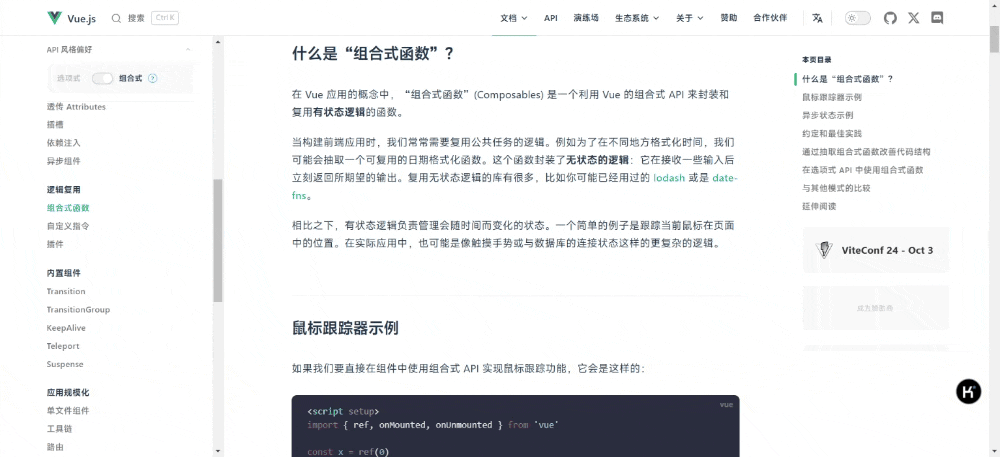

# 基于 DeepSeek AI 大模型的浏览器扩展插件

这是一个浏览器扩展插件，旨在通过选择网页上的文本并调用[DeepSeek](https://deepseek.com)大模型来为用户提供 AI 回复。该扩展插件让你可以直接在网页上与 AI 互动，获取选中文本的总结或解答，提升你的浏览体验。

## 功能特点

- [x] **上下文文本选择**：在网页上高亮显示任何文本，一个弹出窗口将会出现，让您快速获得 AI 驱动的响应。
- [x] **API Key 集成**：支持用户填入自己的 API Key 以访问 DeepSeek 模型。
- [x] **可拖拽和调整大小的窗口**：回复窗口可以拖拽并调整大小，用户可以根据需要将其放置在屏幕的任意位置。
- [x] **AI 流式回复**：支持 AI 模型的流式回复，使用户可以在 AI 生成回复的同时实时互动。
- [x] **Markdown 渲染**：支持以 Markdown 格式渲染 AI 回复，便于查看包括列表、代码块等格式化内容。
- [x] **一键复制**：一键将 AI 回复复制到剪贴板，方便快速使用。
- [x] **重新回答选项**：如果对 AI 回复不满意，用户可以轻松重新提问，获取新的回答。
- [x] **代码复制功能**：增强代码片段复制功能。
- [x] **语言切换功能**：允许用户根据偏好切换回答的语言类型。

## 即将实现的功能

- [ ] **多轮对话**：支持多轮对话功能，使用户可以与 AI 进行连续的深度互动，不局限于一次性问题。
- [ ] **更多功能**：根据用户的需求和反馈，我们将在未来的版本中添加更多功能。

## 安装步骤

按照以下步骤安装该扩展插件：

1. **通过 Chrome Web Store 安装**：访问 [Chrome Web Store](https://chromewebstore.google.com/detail/bjjobdlpgglckcmhgmmecijpfobmcpap) 并点击“添加到 Chrome”按钮进行安装。
2. **克隆仓库**：`git clone https://github.com/DeepLifeStudio/DeepSeekAI.git`
3. **安装依赖**：`npm install`
4. **构建扩展程序**：`npm run build`
5. **将扩展程序加载到您的浏览器中**：
   - 对于 Chrome/Edge：导航到 `chrome://extensions/`（或 `edge://extensions/`）、启用"开发者模式"并单击"加载已解压的扩展程序"选择 `dist` 文件夹。
   - 对于 Firefox：导航到 `about:debugging#/runtime/this-firefox`、单击"加载临时加载项"并选择 `dist/manifest.json` 文件。

## 配置

1. 打开扩展程序弹出窗口并输入您的 DeepSeek API 密钥。
2. 现在扩展程序就可以使用了! 选择网页上的任何文本，AI 驱动的响应将会出现在弹出窗口中。

## 贡献

我们欢迎对 DeepSeekAI 项目的贡献。如果您发现任何问题或有新功能的想法，请随时开一个 issue 或提交一个拉取请求。

## 许可证

该项目采用 [MIT 许可证](LICENSE)。
